# 팔로미 개발 과정

## 1. 프로젝트 발제

> 물류 B2B 배송 플랫폼 — 허브 기반 업체 간 자동 배송 시스템

---

## 2. 도메인 설계

서비스를 어떻게 나눌지, 각 도메인의 책임을 정의하는 과정입니다.

### 도메인 구성

| 도메인 | 서비스 | 설명 |
|--------|--------|------|
| 사용자 | `user-server` | 회원 관리, Keycloak 인증/인가 |
| 허브 | `hub-server` | 물류 허브 관리, 허브 간 경로, 재고 |
| 업체·상품 | `vendor-server` | 공급사·수요사, 상품 카탈로그 |
| 주문 | `order-server` | 주문 생성·취소·상태 관리 |
| 배송 | `delivery-server` | 배송·구간 관리, AI 경로 계획 |
| 알림 | `message-server` | Slack 알림 발송 |

---

## 3. 테이블 설계

각 서비스의 DB 스키마를 설계하는 과정입니다.

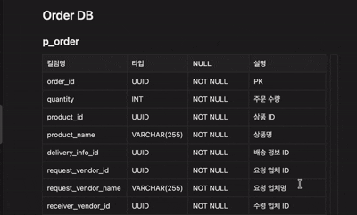

---

## 4. ERD

.png)

---

## 5. 물류센터 서비스 흐름

실제 물류 흐름을 기반으로 한 서비스 시나리오입니다.

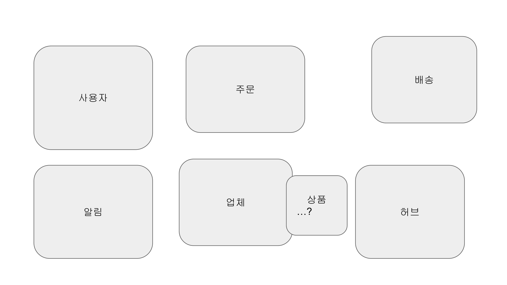
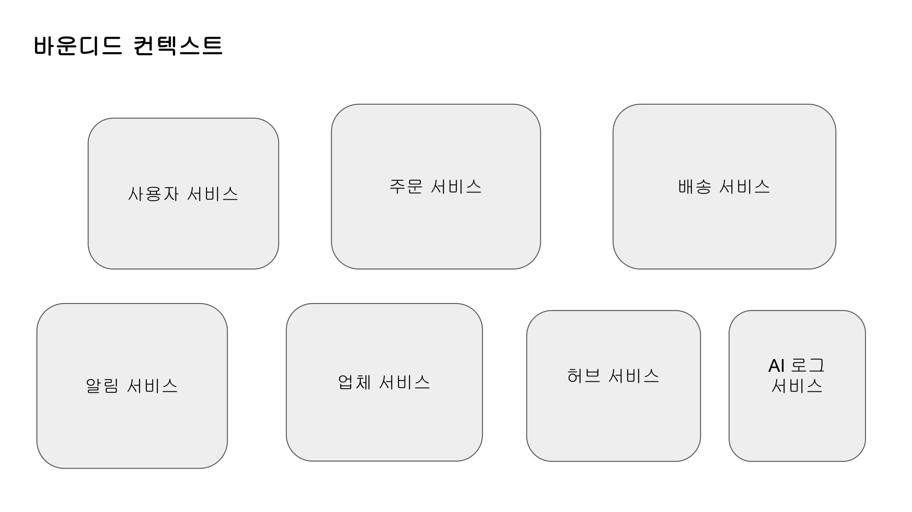
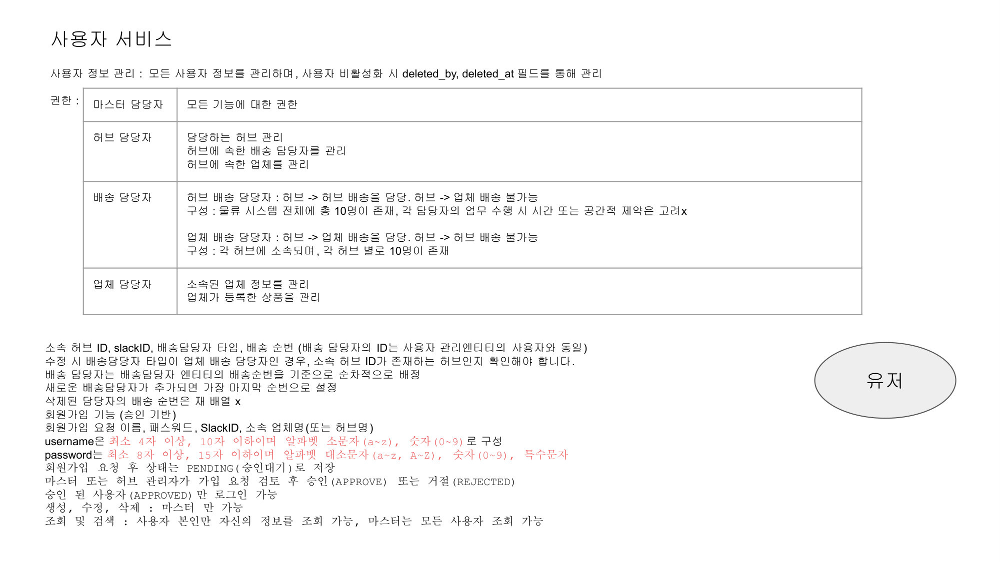
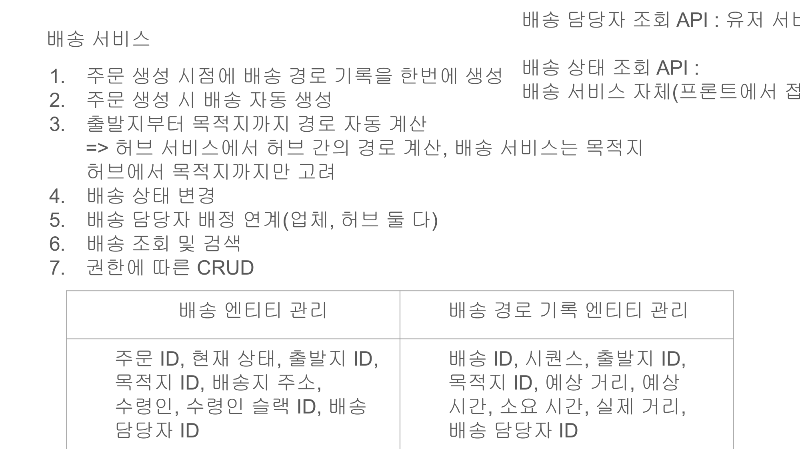
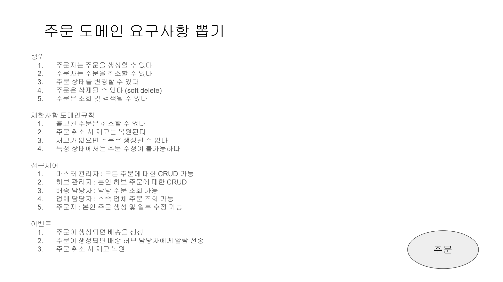
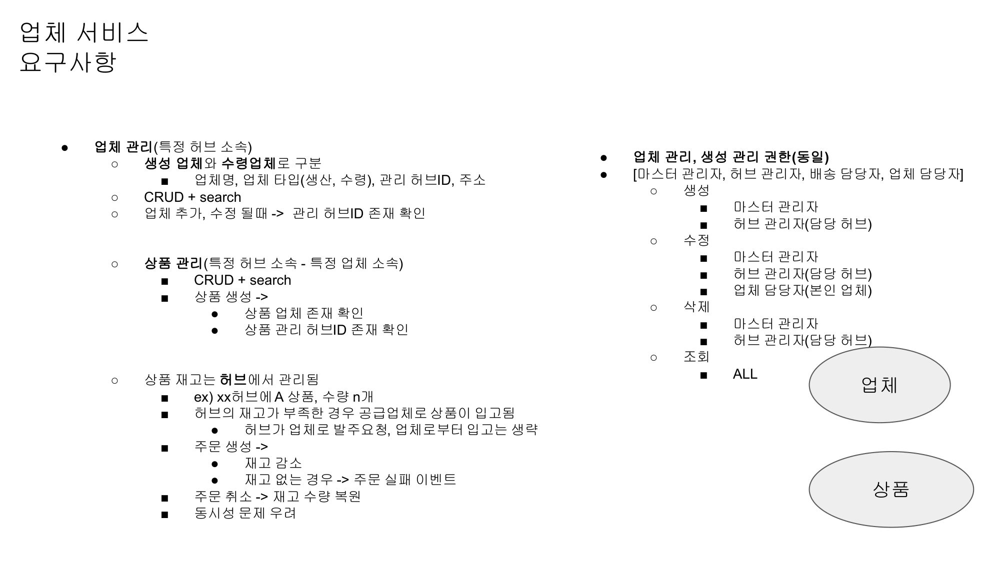
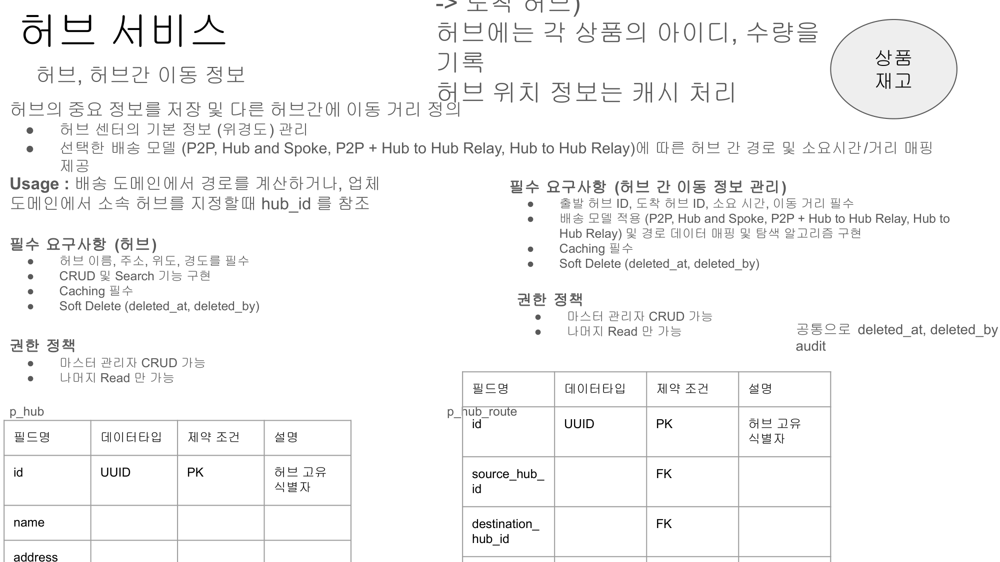
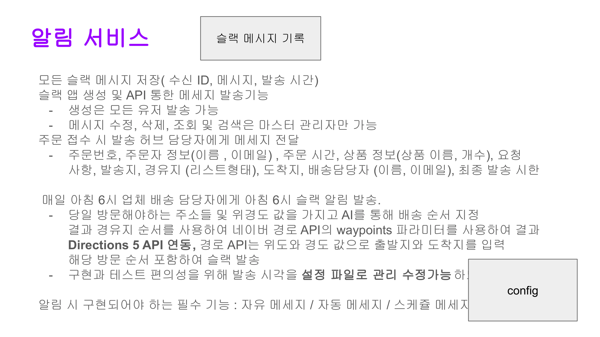
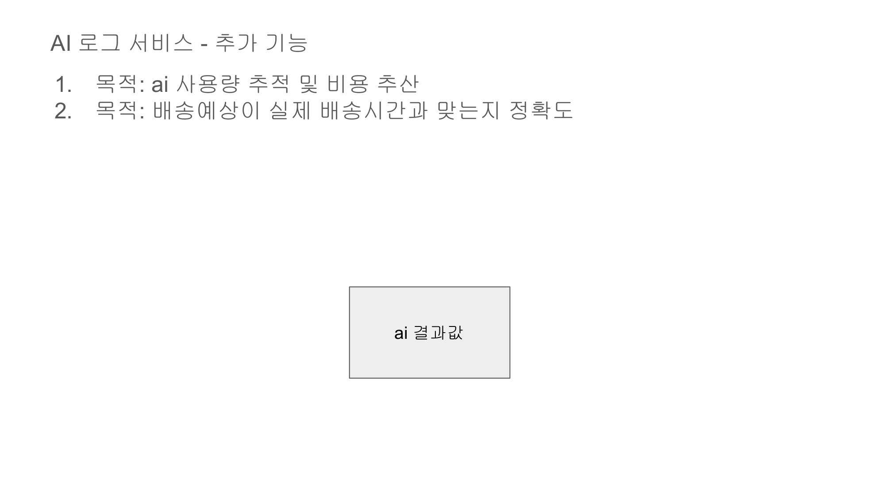
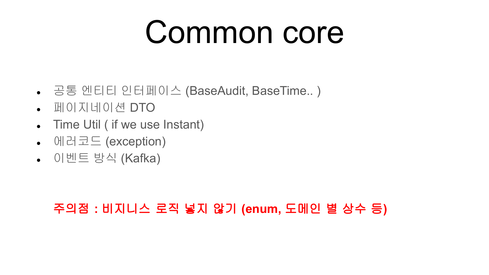

---

## 6. MSA 아키텍처

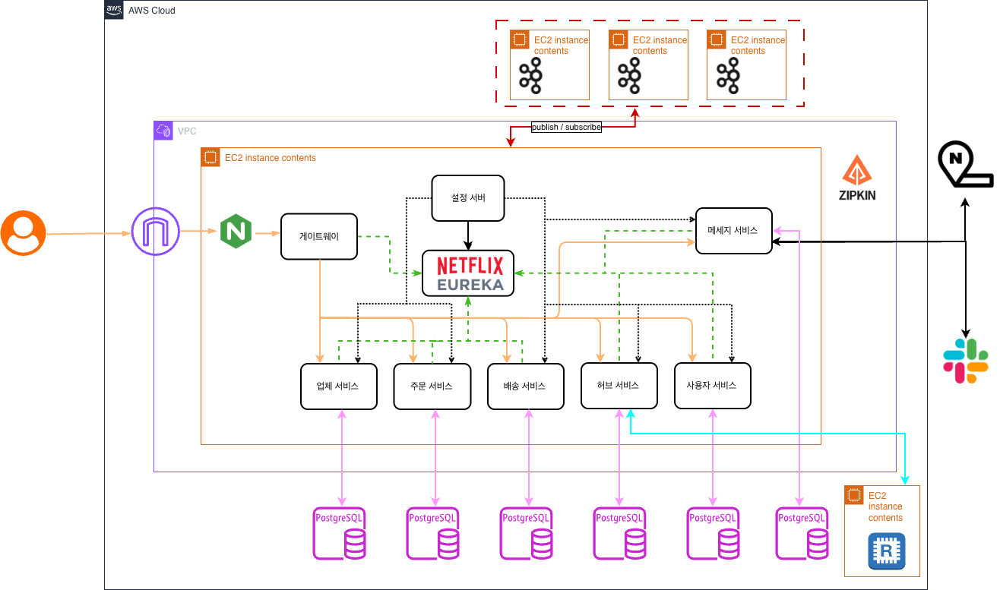

### 아키텍처 구성 요소

| 구성 요소 | 기술 | 설명 |
|-----------|------|------|
| 클라이언트 진입 | Nginx | 외부 요청 수신 및 로드밸런싱 |
| API 게이트웨이 | Spring Cloud Gateway | 라우팅, JWT 검증, X-User-* 헤더 전파 |
| 서비스 디스커버리 | Netflix Eureka | 서비스 등록 및 동적 라우팅 |
| 설정 관리 | Spring Cloud Config | Git 기반 중앙화된 설정 관리 |
| 서비스 간 통신 | OpenFeign + Resilience4j | 선언적 HTTP 클라이언트 + Circuit Breaker |
| 비동기 메시지 | Apache Kafka | 허브 재고 이벤트 Publish / Subscribe |
| 캐싱 | Redis | 허브 정보 캐싱으로 조회 성능 향상 |
| 분산 추적 | Zipkin | 서비스 간 요청 추적 및 레이턴시 모니터링 |
| 알림 | Slack Webhook | 배송 상태 알림 발송 |
| 경로 탐색 | Google Gemini API | AI 배송 경로 계획 |
| 데이터베이스 | PostgreSQL × 6 | 서비스별 독립 DB (업체·주문·배송·허브·사용자·메세지) |

---

## 7. 기술적 의사결정

### MSA 구성

| 항목 | 선택 | 이유 |
|------|------|------|
| 로드밸런서 | Nginx | 외부 트래픽 수신 및 Gateway로 프록시 |
| 서비스 디스커버리 | Netflix Eureka | Spring Cloud 생태계와의 높은 호환성 |
| API 게이트웨이 | Spring Cloud Gateway | 리액티브 처리, JWT 필터 연동 용이 |
| 설정 관리 | Spring Cloud Config | Git 기반 중앙화된 설정 관리 |
| 서비스 간 통신 | OpenFeign + Resilience4j | 선언적 HTTP 클라이언트 + Circuit Breaker |
| 이벤트 처리 | Apache Kafka | 허브 재고 이벤트 비동기 처리 |
| 캐싱 | Redis | 허브 정보 캐싱으로 조회 성능 향상 |
| 분산 추적 | Zipkin | 마이크로서비스 간 요청 흐름 시각화 |

### 인증·인가

| 항목 | 선택 | 이유 |
|------|------|------|
| 토큰 방식 | JWT (Bearer) | Stateless, 게이트웨이에서 일괄 검증 |
| 권한 전파 | X-User-* 헤더 | 하위 서비스는 헤더만 읽어 DB 조회 없이 권한 확인 |

### ORM 선택

| 서비스 | ORM | 이유 |
|--------|-----|------|
| user, hub, vendor, order | Spring Data JPA + QueryDSL | 복잡한 동적 쿼리 처리 |
| delivery | jOOQ | 타입 세이프 SQL, 복잡한 배송 경로 쿼리 최적화 |

---

## 8. 트러블슈팅

> 각 서비스 리포지토리의 이슈 트래커를 참고하세요.
> [GitHub Projects 보기](https://github.com/orgs/8ollowMe/projects/4)