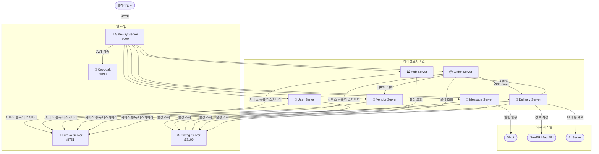
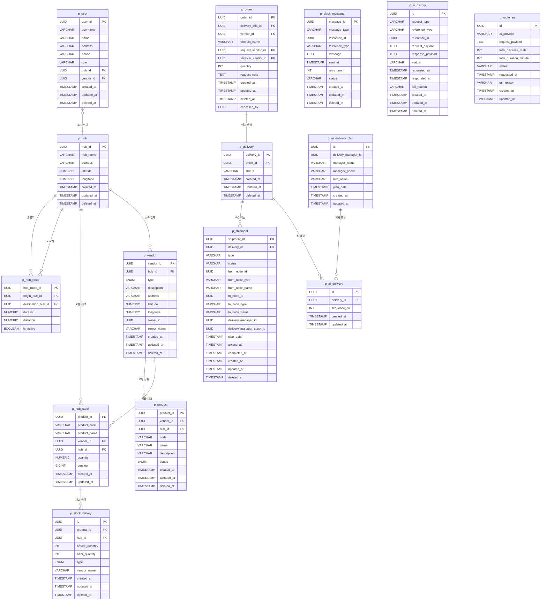

# 🚚 팔로미 (8ollowMe)

> **B2B 물류 배송 플랫폼** — 허브 기반 업체 간 주문·배송을 자동화하는 MSA 물류 시스템

---

## 📌 프로젝트 소개

팔로미는 공급사와 수요사 사이의 물류 흐름을 **허브(Hub) 기반으로 자동화**하는 B2B 배송 플랫폼입니다.  
주문이 생성되면 배송 경로가 자동으로 계산되고, 허브 간 구간 배송(Shipment)으로 분리되어 관리됩니다.  
인증·인가는 Keycloak, 서비스 간 통신은 OpenFeign + Eureka, 알림은 Slack 메시지로 처리됩니다.

---

## 👥 팀원 및 역할 분담

| 이름 | 담당 서비스 | GitHub | Blog |
|------|------------|--------|------|
| 권진석 | `message-server` | [@kjs0406](https://github.com/kjs0406) | [Blog](https://velog.io/@kjs0406/posts) |
| 김준언 | `hub-server` | [@kimjuneon](https://github.com/kimjuneon) | [Blog](https://velog.io/@juneon/posts) |
| 서민석 | `user-server` | [@qldo](https://github.com/qldo) | [Blog](http://zpfh.tistory.com) |
| 예준성 | `order-server` | [@gnoesnooj](https://github.com/gnoesnooj) | [Blog](https://velog.io/@gnoesnooj) |
| 정승현 | `hub-server` (재고) · `vendor-server` | [@jsh9057](https://github.com/jsh9057) | [Blog](https://in-intuition.tistory.com/) |
| 하지혜 | `delivery-server` | [@AnnieHa1002](https://github.com/AnnieHa1002) | [Blog](https://dev-annieha.tistory.com/) |

---

## 🛠️ 기술 스택

### Backend


### Database & ORM


### Infra & Messaging


### Service Mesh


---

## 🏗️ 시스템 아키텍처



---

## 📋 ERD



---

## 🚀 서비스 구성 및 실행 방법

### 사전 요구사항

- Java 21
- Docker & Docker Compose
- Gradle 8.x

### 1. 인프라 서비스 실행

**Keycloak + PostgreSQL (user-server)**
```bash
git clone https://github.com/8ollowMe/user-server
cd user-server
docker-compose up -d
```

**Config Server**
```bash
git clone https://github.com/8ollowMe/config-server
cd config-server
./gradlew bootRun
# 포트: 13100
```

**Eureka Server**
```bash
git clone https://github.com/8ollowMe/eureka-server
cd eureka-server
./gradlew bootRun
# 포트: 8761  →  http://localhost:8761
```

**Gateway Server**
```bash
git clone https://github.com/8ollowMe/gateway-server
cd gateway-server
./gradlew bootRun
# 포트: 8000
```

### 2. 마이크로서비스 실행 순서

인프라(Config → Eureka → Gateway) 기동 후 아래 순서로 실행합니다.

```bash
# 각 서비스 디렉토리에서
./gradlew bootRun
```

| 순서 | 서비스 | 리포지토리 |
|------|--------|-----------|
| 1 | user-server | [바로가기](https://github.com/8ollowMe/user-server) |
| 2 | hub-server | [바로가기](https://github.com/8ollowMe/hub-server) |
| 3 | vendor-server | [바로가기](https://github.com/8ollowMe/vendor-server) |
| 4 | order-server | [바로가기](https://github.com/8ollowMe/order-server) |
| 5 | delivery-server | [바로가기](https://github.com/8ollowMe/delivery-server) |
| 6 | message-server | [바로가기](https://github.com/8ollowMe/message-server) |

### 3. API 게이트웨이 엔드포인트

모든 외부 요청은 `http://localhost:8000` 을 통해 라우팅됩니다.

| 서비스 | 경로 |
|--------|------|
| 사용자 | `/api/v1/users/**` |
| 허브 | `/api/v1/hubs/**`, `/api/v1/hub-routes/**` |
| 허브 재고 | `/api/v1/stocks/**`, `/api/v1/stock-histories/**` |
| 업체·상품 | `/api/v1/vendors/**`, `/api/v1/products/**` |
| 주문 | `/api/v1/orders/**` |
| 배송·구간 | `/api/v1/deliveries/**`, `/api/v1/shipments/**` |
| 알림 | `/api/v1/slack-messages/**`, `/api/v1/notifications/**` |
| AI | `/api/v1/ai/**` |

### 4. 인증

1. `POST /api/v1/users/sign-up` 으로 회원가입
2. Keycloak(`http://localhost:9090`)을 통해 토큰 발급
3. 이후 모든 요청 헤더에 `Authorization: Bearer <token>` 포함

---

## 📄 API 문서

통합 API 문서는 **[여기](https://8ollowme.github.io/.github/docs/api)** 에서 확인할 수 있습니다.

---

## 📊 프로젝트 관리

- **GitHub Projects:** [FollowMeProject](https://github.com/orgs/8ollowMe/projects/4) — 146개 이슈 트래킹 (Done 103 / In Progress 20 / Todo 18)
- **개발 과정:** [개발 일지 보기](../docs/development.md)

---

## 📁 리포지토리 구성

| 리포지토리 | 설명                              |
|-----------|---------------------------------|
| [eureka-server](https://github.com/8ollowMe/eureka-server) | 서비스 디스커버리 (Netflix Eureka)      |
| [config-server](https://github.com/8ollowMe/config-server) | 중앙 설정 서버 (Spring Cloud Config)  |
| [gateway-server](https://github.com/8ollowMe/gateway-server) | API 게이트웨이 · JWT 인증 필터           |
| [user-server](https://github.com/8ollowMe/user-server) | 회원 관리 · Keycloak 인증/인가          |
| [hub-server](https://github.com/8ollowMe/hub-server) | 허브 · 허브 경로 · 재고 관리              |
| [vendor-server](https://github.com/8ollowMe/vendor-server) | 업체 · 상품 관리                      |
| [order-server](https://github.com/8ollowMe/order-server) | 주문 생성 · 상태 관리                   |
| [delivery-server](https://github.com/8ollowMe/delivery-server) | 배송 · 구간 배송 · 배송자 지정 로직          |
| [message-server](https://github.com/8ollowMe/message-server) | Slack 알림 발송 · 이력 관리 · ai 배송지 추천 |
| [common-lib](https://github.com/8ollowMe/common-lib) | 공통 라이브러리 (예외, 응답 포맷 등)          |
| [project-configs](https://github.com/8ollowMe/project-configs) | Config Server용 설정 파일 저장소        |